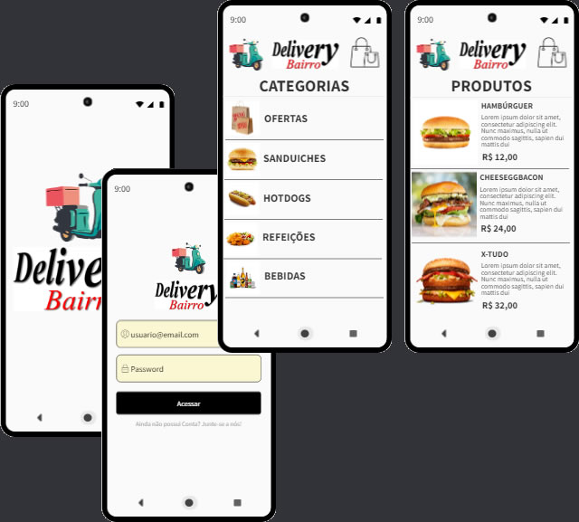

# DeliveryBairro App 
Projeto desenvolvido em React Native + Expo CLI para gestão de pedidos e entregas foco no segmento de Delivery em Geral, tais como Bares, Restaurantes, Fastfoods, Distribuidoras de Bebidas, Farmárcias, Drograrias, Mercados de Conveniência, Supermercados, Gás de Cozinha, Água Mineral, etc.

## instalação
para instalar as dependências (node_modules) e executar o App, remova antes a pasta pasta "node_nodules" e o arquivo "yarn.lock" se existirem e execute o comando na pasta raiz:

<strong>yarn install</strong> 
para abrir e executar digite na pasta raiz do projeto:
<strong>code . && npx expo start</strong>

## Run 
-> "npx expo start" ou "expo run:android" para compilar e gerar o APK no dispositivo mobile via USB ou Wi-Fi c/ Expo.Go

## Atualizando o NodeJs/npm, Expo-CLI e EAS-CLI
https://www.npmjs.com/package/npm-windows-upgrade

npm install -g expo-cli
npm install -g eas-cli

## re-build das unimodules
expo prebuild

## deployment
<strong>eas build -p android --profile preview</strong>

## Using FCM for Push Notifications
See at https://docs.expo.dev/push-notifications/using-fcm/
Finally, make a new build of your app by <strong>running eas build --platform android</strong> (or <strong>expo build:android<strong> if you're using the classic build system).

## Link para baixar o APK DeliveryBairro v1.0 (MVP) Build #1 (Quinta-feira, 27/10/2022 às 12:07)
https://expo.dev/artifacts/eas/fByfzoZUQava4UaUjLChQa.apk

## Contato

telefone: (31) 98410-7540 WhatsApp

email: ezequiasmartins@gmail.com

by <a href="https://ezequiasmartins.blogspot.com/" target="_blank">Ezequias Martins</a> ® 1999-2022 Direitos Reservados

chat with Open AI
https://chat.openai.com/auth/login

Dorothy L. Sayers - "As Ferramentas Perdidas da Aprendizagem"

Stephen E. Ambrose
Band of Brothers (Compahia de Heróis)

